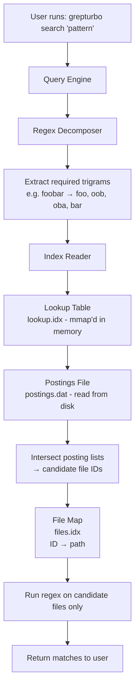
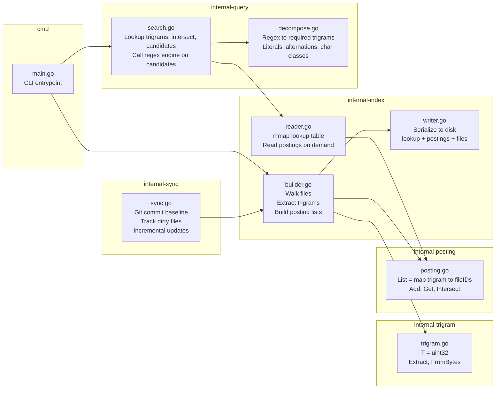
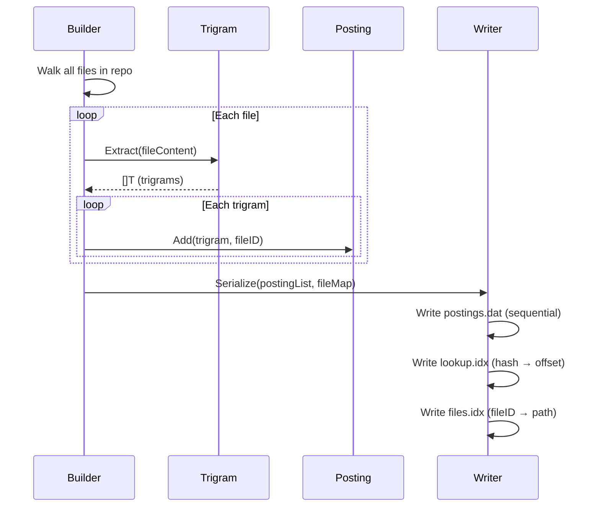
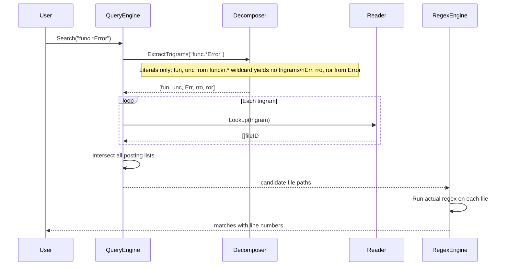
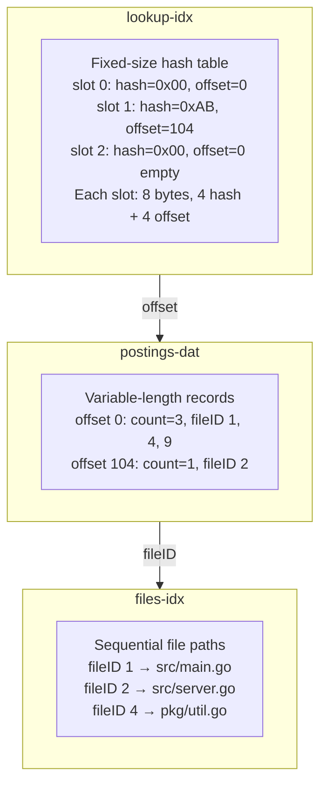
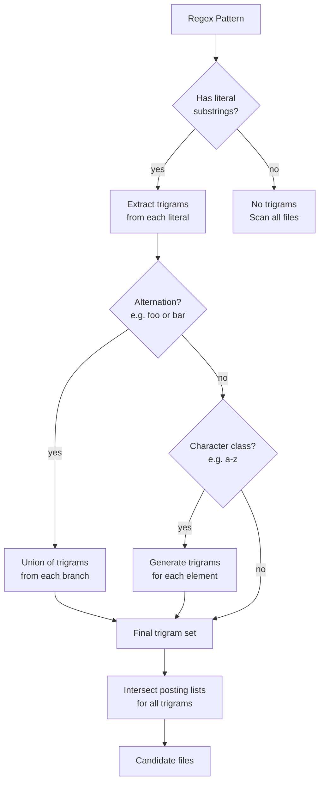
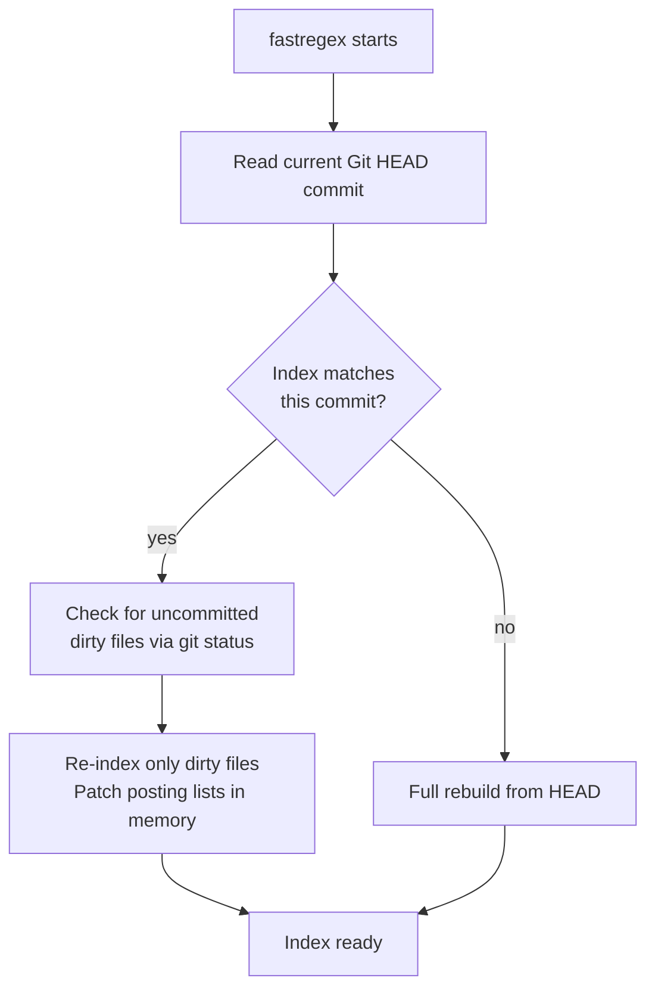

# GrepTurbo — Architecture

## Overview

GrepTurbo builds a local trigram-indexed inverted index over a codebase so that regex queries
can skip irrelevant files entirely, instead of scanning every file like `ripgrep` does.

The index answers the question:
> "Which files *might* contain a match for this regex?"

Then the regex engine runs only on that small candidate set.

**Key win:** On a 10,000-file codebase, queries drop from ~2.5s (scanning all) to ~0.5s (50 candidates). The speedup grows with codebase size.

---

## High-Level Flow

### Build Phase (one-time or incremental)

```
User runs: grepturbo build -root ./myproject

           ↓

   Walk directory tree, read files
   Extract trigrams from each file
   Build in-memory posting lists
   
           ↓
   
   Serialize to disk:
   - lookup.idx    (mmap'd hash table: trigram → offset)
   - postings.dat  (posting lists: count + file IDs)
   - files.idx     (file ID → path mapping)
   - metadata.json (root dir, skip patterns, git commit)
```

### Query Phase (repeated, fast)



### Freshness Check

```
When search runs:
  - Read git HEAD commit from .git/
  - Check if index metadata.json matches this commit
  - If no match → full rebuild + retry search
  - If match → check git status for uncommitted files
  - Re-index only dirty files, patch posting lists in memory
```

---

## Component Architecture



---

## Data Flow: Index Build



---

## Data Flow: Query



---

## On-Disk Format



---

## Regex Decomposition Rules



---

## Incremental Sync Strategy



---

## Build Order (implementation sequence)

```mermaid
flowchart LR
    P1["Phase 1: trigram.go\nExtract overlapping trigrams\nfrom strings"] -->
    P2["Phase 2: posting.go\nBuild in-memory\ninverted index"]
    P2 -->
    P3["Phase 3: index/builder.go\nWalk files, extract trigrams,\nbuild posting lists"]
    P3 -->
    P4["Phase 3b: index/writer.go\nSerialize to disk\n3 files: lookup, postings, files"]
    P4 -->
    P5["Phase 4: index/reader.go\nmmap lookup table,\nread postings on demand"]
    P5 -->
    P6["Phase 5: query/decompose.go\nRegex → required trigrams"]
    P6 -->
    P7["Phase 6: query/search.go\nFull pipeline:\nlookup → intersect → regex"]
    P7 -->
    P8["Phase 7: index/sync.go\nGit tracking + dirty overlay\nfor incremental updates"]
    P8 -->
    P9["Phase 8: cmd/main.go\nCLI: build, search, init"]
```



**Status:** Phases 1–9 complete. All core functionality implemented.

---

## Map to Disk: The Translation Layer

### Problem: In-Memory Maps Can't Go Directly to Disk

A Go `map[uint32][]uint32` is a heap-allocated structure with pointer chains:

```go
m := make(map[uint32][]uint32)
m[0x12345678] = []uint32{1, 5, 9}
```

This creates:
- hmap struct with metadata
- Bucket array with pointers
- Key-value pairs in buckets
- Overflow chains for collisions

**This only works in RAM.** You cannot serialize it to disk and read it back as a map. What you get is raw bytes - no structure, no pointers.

### Solution: Convert Map to Disk Format

The architecture solves this with a three-phase approach:

```
┌──────────────────────────────────────────────────────────────────┐
│                        BUILD TIME                                │
│                                                                  │
│   builder.go              writer.go                              │
│   ┌──────────────┐       ┌──────────────────────────────────┐   │
│   │ map[uint32]   │  ──►  │ lookup.idx: fixed-size hash table│   │
│   │ []uint32      │       │ postings.dat: sequential records │   │
│   │ (in-memory)   │       │ files.idx: fileID → path         │   │
│   └──────────────┘       └──────────────────────────────────┘   │
└──────────────────────────────────────────────────────────────────┘
                              │
                              ▼
┌──────────────────────────────────────────────────────────────────┐
│                        QUERY TIME                                │
│                                                                  │
│   reader.go                                                       │
│   ┌──────────────────────────────────────────────────────────┐   │
│   │ 1. mmap lookup.idx (just bytes, no map!)                  │   │
│   │ 2. Binary search for hash                                  │   │
│   │ 3. Get offset → read postings.dat at that offset          │   │
│   │ 4. Return posting list                                     │   │
│   └──────────────────────────────────────────────────────────┘   │
└──────────────────────────────────────────────────────────────────┘
```

### Writer Serialization Process

```go
// Simplified writer.go logic
func WriteIndex(postingList map[uint32][]uint32) {
    // Step 1: Sort hashes for binary search
    sortedHashes := make([]uint32, 0, len(postingList))
    for hash := range postingList {
        sortedHashes = append(sortedHashes, hash)
    }
    sort.Slice(sortedHashes, func(i, j int) bool {
        return sortedHashes[i] < sortedHashes[j]
    })

    // Step 2: Write postings sequentially to postings.dat
    offsets := make([]uint32, len(sortedHashes))
    for i, hash := range sortedHashes {
        fileIDs := postingList[hash]
        offset := writePostings(fileIDs)  // returns file offset
        offsets[i] = offset
    }

    // Step 3: Write lookup table (hash → offset)
    // Fixed-size: 8 bytes per entry (4 bytes hash + 4 bytes offset)
    for i, hash := range sortedHashes {
        writeUint32(hash)
        writeUint32(offsets[i])
    }
}
```

### Reader Lookup Process

```go
// Simplified reader.go logic
func (r *Reader) Lookup(hash uint32) []uint32 {
    // Step 1: Binary search mmap'd lookup table
    offset := binarySearch(r.lookupTable, hash)
    if offset == 0 {
        return nil  // not found
    }

    // Step 2: Seek to offset in postings.dat
    r.postingsFile.Seek(offset, os.SEEK_SET)

    // Step 3: Read count + fileIDs
    count := readUint32()
    fileIDs := make([]uint32, count)
    for i := uint32(0); i < count; i++ {
        fileIDs[i] = readUint32()
    }
    return fileIDs
}
```

### Why This Works

| In-Memory Map | On-Disk Format |
|---------------|----------------|
| `m[key]` | Binary search on sorted array |
| Dynamic resize | Fixed size (pre-allocated at build) |
| Pointer chains | Just offsets (no pointers) |
| O(1) amortized | O(log n) search + O(1) read |
| GC managed | mmap'd - no GC, OS manages pages |

### Key Insight

> **The map exists only during BUILD time.** After writing to disk, it's gone.
> At query time, we reconstruct the lookup logic using the on-disk format.

This is why we have separate components:
- `builder.go` - builds in-memory map
- `writer.go` - converts map to disk format
- `reader.go` - queries disk format without needing a map

---

## Key Invariant: No False Negatives

**The golden rule:**
> If a file contains a regex match, it **must** appear in the candidate set.
> False positives (candidates that don't match) are acceptable and expected.

This is enforced by:
- **Conservative trigram decomposition**: If a pattern contains wildcards (e.g., `func.*Error`), 
  extract only trigrams from literals. If a literal substring exists, any file matching the regex 
  must contain all trigrams from that substring.
- **Conservative intersection**: Return the union of all candidates, never a subset that might 
  exclude files with partial matches.
- **Hash collisions allowed**: If two different trigrams hash to the same value, 
  the candidate set widens—but matches are never lost.

**Verification:** See `internal/query/search_integration_test.go` for correctness tests against `grep` output.

---

## CLI Integration (cmd/grepturbo/main.go)

GrepTurbo exposes three subcommands:

### `grepturbo build [flags]`

Walks a directory tree and builds the index. Stores three files (lookup.idx, postings.dat, files.idx)
plus metadata.json recording root dir, skip patterns, and git commit hash.

**Flags:**
- `-root <dir>`: Directory to index (default: `.`)
- `-out <dir>`: Directory to write the index (default: `.grepturbo`)
- `--skip <dir>`: Directory name to skip (repeatable; e.g., `--skip node_modules --skip dist`)

**Example:**
```bash
grepturbo build -root ./myproject -out .grepturbo --skip node_modules --skip .git
```

### `grepturbo search <pattern> [flags]`

Queries the index with a regex pattern. Automatically detects index drift and rebuilds if needed.
Output is `file:line:text` (grep-compatible).

**Flags:**
- `-index <dir>`: Index directory to query (default: `.grepturbo`)

**Examples:**
```bash
grepturbo search 'func.*Error'
grepturbo search -index .grepturbo 'TODO.*FIXME'
grepturbo 'TODO'  # shorthand: search is implicit
```

**Exit codes:**
- `0`: Matches found and printed to stdout
- `1`: No matches found (grep convention)
- `2`: Error (invalid regex, missing index, etc.)

### `grepturbo init`

Installs agent instructions into `~/.claude/` so Claude Code prefers `grepturbo search` over `grep/ripgrep`.
After running `init`, Claude Code will use grepturbo for all pattern searches in the project.

---

## Key Design Decisions

| Decision | Choice | Why |
|---|---|---|
| Trigram size | 3 chars | Bigrams = too many collisions, quadgrams = too many keys |
| Packing | `uint32` | O(1) map ops vs O(n) string comparison |
| Lookup table | Hash table, mmap'd | Stays in OS page cache, no heap allocation |
| Postings | Sequential on disk | Read only the lists you need, not the whole file |
| Hash collisions | Allowed | Widen candidate set (false positives ok), never miss matches |
| False negatives | Never allowed | The golden invariant: if a file matches, it must be a candidate |
| Index freshness | Git commit + dirty overlay | Fast startup, correct for agent workflows |
